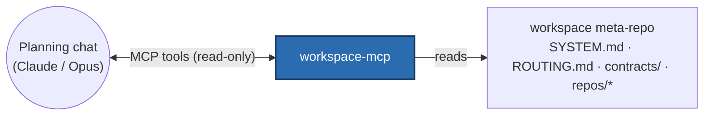

# workspace-mcp

**A read-only MCP server that lets a planning AI read an entire multi-repo system —
its architecture map, routing, contracts, dependency graph and scoped repo files —
directly, instead of pasting files in by hand.**

It is the design-time introspection layer for a local RAG system built from several
independent service repos (titan, brain-mcp, brain-dashboard, obsidian-inbox-watcher),
coordinated by a workspace "meta-repo".

## The problem it solves

Architecting a change across several repos means a strong reasoning model (e.g.
Claude/Opus in a planning chat) needs to *see* the system: which service owns what,
which contracts couple them, what the real code looks like. Without tooling you
copy-paste files into the chat by hand. workspace-mcp exposes that context as MCP
tools, so the planning model reads the live workspace itself.



## Tools (all strictly read-only)

| Tool | Returns |
|---|---|
| `list_repos` | service names + roles from the manifest |
| `get_system_map` | the system architecture & data-flow doc |
| `get_routing` | which repo owns which kind of change |
| `get_contracts_overview` | the human-readable inter-service contracts |
| `list_contracts` | the machine-readable contract files |
| `get_contract` | the contents of one contract (sandboxed) |
| `dependency_graph` | the consumer → provider edges between services |
| `read_repo_file` | a single repo file (sandboxed, read-only, size-capped) |

## Design highlights

- **Read-only is a hard security boundary.** The server is meant to be reachable
  over the same public path as the system's other connector — so it must never be
  able to write the repo or run commands. Every tool is a pure read; there are no
  write/scaffold/exec tools, by design.
- **Path-traversal sandboxing.** `read_repo_file` and `get_contract` resolve the
  target path and reject anything that escapes the authorized base directory
  (`is_relative_to` check) — no `..` or absolute-path escapes.
- **Reverse-proxy deployment.** Claude custom connectors only work reliably on port
  443, but the node's single Tailscale Funnel root is already taken by another MCP
  server. A **Caddy reverse proxy** fronts the one 443 funnel and routes by path
  (`/` → the other server, `/ws/*` → workspace-mcp), with the server advertising its
  OAuth/MCP URLs under `/ws`. See [`deploy/README.md`](deploy/README.md).
- **Reuses existing tooling.** Graph/manifest queries shell out to the workspace's
  own tested `scripts/manifest.py` rather than re-parsing YAML.
- **Auth.** In the public HTTP mode, a GitHub OAuth proxy with a login allowlist
  gates every request (mirrors the sibling brain-mcp pattern). In local `stdio` mode
  no auth is needed.

## Setup

Requires [uv](https://docs.astral.sh/uv/) and Python 3.12+.

```bash
make install    # install dependencies + pre-commit hooks
```

Run locally over stdio (no Caddy, no funnel, no OAuth):

```bash
python -m workspace_mcp     # WORKSPACE_ROOT points at the workspace checkout
```

The public connector deployment (Caddy + Tailscale Funnel + GitHub OAuth) is
documented in [`deploy/README.md`](deploy/README.md).

## Development

```bash
make test       # run tests with coverage (incl. the path-traversal rejection test)
make check      # full quality gate: lint + types + tests
make format     # auto-fix style issues
make help       # list all available commands
```

## Project Structure

```
src/workspace_mcp/    Source code (config, auth, the read-only MCP tools)
tests/               Pytest tests (mirrors src/ layout)
deploy/              Caddy + systemd units + connector guide
docs/ai/             architecture, decisions and plans
.github/workflows/   CI configuration
```

## Tooling

| Tool         | Purpose                              |
|--------------|--------------------------------------|
| **uv**       | Package manager + Python installer   |
| **ruff**     | Linter + formatter                   |
| **mypy**     | Static type checker (strict mode)    |
| **pytest**   | Test runner with coverage            |
| **pre-commit** | Git hook runner                    |

All tools run in CI on every push.

## Documentation & developer workflow

In-depth architecture and design decisions live in [`docs/ai/`](docs/ai/). These
files also drive a structured AI-assisted development workflow; `CLAUDE.md`
(mirrored as `AGENTS.md`/`GEMINI.md`) is the entry point for any agent.

🇩🇪 Eine deutsche Fassung dieser README gibt es unter [README.de.md](README.de.md).

## License

MIT — see [LICENSE](LICENSE).
