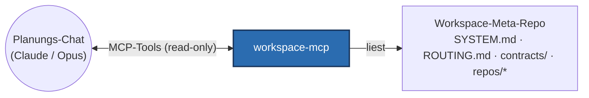

# workspace-mcp

**Ein read-only MCP-Server, der einer Planungs-KI ein ganzes Multi-Repo-System
direkt lesbar macht — Architekturkarte, Routing, Contracts, Abhängigkeitsgraph und
gescopte Repo-Dateien — statt Dateien von Hand einzufügen.**

Er ist die Design-Zeit-Introspektionsschicht für ein lokales RAG-System aus mehreren
unabhängigen Service-Repos (titan, brain-mcp, brain-dashboard, obsidian-inbox-watcher),
koordiniert von einem Workspace-„Meta-Repo".

## Das Problem, das er löst

Eine Änderung über mehrere Repos hinweg zu entwerfen heißt: ein starkes
Reasoning-Modell (z. B. Claude/Opus in einem Planungs-Chat) muss das System *sehen* —
welcher Service was besitzt, welche Contracts sie koppeln, wie der echte Code aussieht.
Ohne Tooling kopiert man Dateien von Hand in den Chat. workspace-mcp stellt diesen
Kontext als MCP-Tools bereit, sodass das Planungsmodell den Live-Workspace selbst liest.



## Werkzeuge (alle strikt read-only)

| Werkzeug | Liefert |
|---|---|
| `list_repos` | Service-Namen + Rollen aus dem Manifest |
| `get_system_map` | das System-Architektur- & Datenfluss-Dokument |
| `get_routing` | welches Repo welche Art von Änderung besitzt |
| `get_contracts_overview` | die menschenlesbaren Inter-Service-Contracts |
| `list_contracts` | die maschinenlesbaren Contract-Dateien |
| `get_contract` | den Inhalt eines Contracts (gesandboxt) |
| `dependency_graph` | die Konsument → Provider-Kanten zwischen Services |
| `read_repo_file` | eine einzelne Repo-Datei (gesandboxt, read-only, größenbegrenzt) |

## Design-Highlights

- **Read-only als harte Security-Grenze.** Der Server soll über denselben
  öffentlichen Pfad erreichbar sein wie der andere Connector des Systems — er darf
  also nie das Repo schreiben oder Befehle ausführen können. Jedes Tool ist ein
  reiner Read; es gibt by design keine Schreib-/Scaffold-/Exec-Tools.
- **Path-Traversal-Sandboxing.** `read_repo_file` und `get_contract` lösen den
  Zielpfad auf und lehnen alles ab, was das autorisierte Basis-Verzeichnis verlässt
  (`is_relative_to`-Check) — keine `..`- oder Absolutpfad-Escapes.
- **Reverse-Proxy-Deployment.** Claude-Custom-Connectors funktionieren nur auf Port
  443 zuverlässig, aber der einzige Tailscale-Funnel-Root des Nodes ist bereits von
  einem anderen MCP-Server belegt. Ein **Caddy-Reverse-Proxy** steht vor der einen
  443-Funnel und routet nach Pfad (`/` → der andere Server, `/ws/*` → workspace-mcp);
  der Server bewirbt seine OAuth-/MCP-URLs unter `/ws`. Siehe
  [`deploy/README.md`](deploy/README.md).
- **Wiederverwendung bestehender Tools.** Graph-/Manifest-Abfragen rufen das eigene,
  getestete `scripts/manifest.py` des Workspaces auf, statt YAML neu zu parsen.
- **Auth.** Im öffentlichen HTTP-Modus gatet ein GitHub-OAuth-Proxy mit Login-Allowlist
  jeden Request (spiegelt das Schwester-Pattern von brain-mcp). Im lokalen
  `stdio`-Modus ist keine Auth nötig.

## Einrichtung

Erfordert [uv](https://docs.astral.sh/uv/) und Python 3.12+.

```bash
make install    # Abhängigkeiten + pre-commit-Hooks installieren
```

Lokal über stdio ausführen (kein Caddy, keine Funnel, kein OAuth):

```bash
python -m workspace_mcp     # WORKSPACE_ROOT zeigt auf den Workspace-Checkout
```

Das Deployment als öffentlicher Connector (Caddy + Tailscale Funnel + GitHub OAuth)
ist in [`deploy/README.md`](deploy/README.md) dokumentiert.

## Entwicklung

```bash
make test       # Tests mit Coverage (inkl. Path-Traversal-Ablehnungs-Test)
make check      # vollständiges Quality-Gate: Lint + Typen + Tests
make format     # Style-Probleme automatisch beheben
make help       # alle verfügbaren Befehle auflisten
```

## Projektstruktur

```
src/workspace_mcp/    Quellcode (Config, Auth, die read-only MCP-Tools)
tests/               Pytest-Tests (spiegelt das src/-Layout)
deploy/              Caddy + systemd-Units + Connector-Anleitung
docs/ai/             Architektur, Entscheidungen und Pläne
.github/workflows/   CI-Konfiguration
```

## Tooling

| Tool         | Zweck                                |
|--------------|--------------------------------------|
| **uv**       | Paketmanager + Python-Installer      |
| **ruff**     | Linter + Formatter                   |
| **mypy**     | Statischer Typprüfer (Strict Mode)   |
| **pytest**   | Test-Runner mit Coverage             |
| **pre-commit** | Git-Hook-Runner                    |

Alle Tools laufen bei jedem Push in der CI.

## Dokumentation & Entwickler-Workflow

Vertiefende Architektur- und Designentscheidungen liegen in [`docs/ai/`](docs/ai/).
Diese Dateien dienen zugleich einem strukturierten KI-gestützten Entwicklungsworkflow;
`CLAUDE.md` (gespiegelt als `AGENTS.md`/`GEMINI.md`) ist der Einstiegspunkt für jeden Agenten.


## Lizenz

MIT — siehe [LICENSE](LICENSE).
